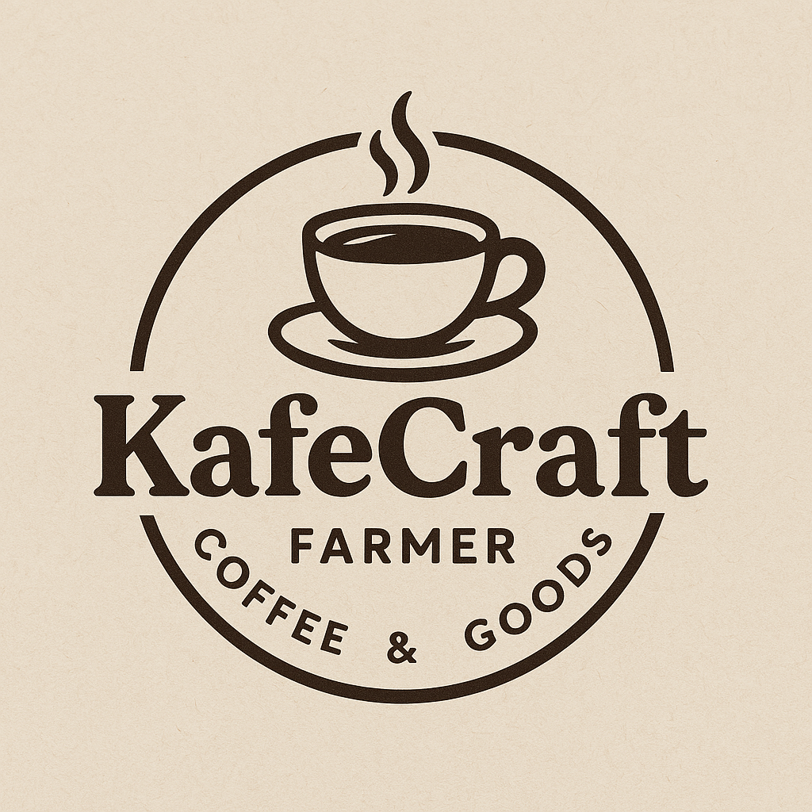
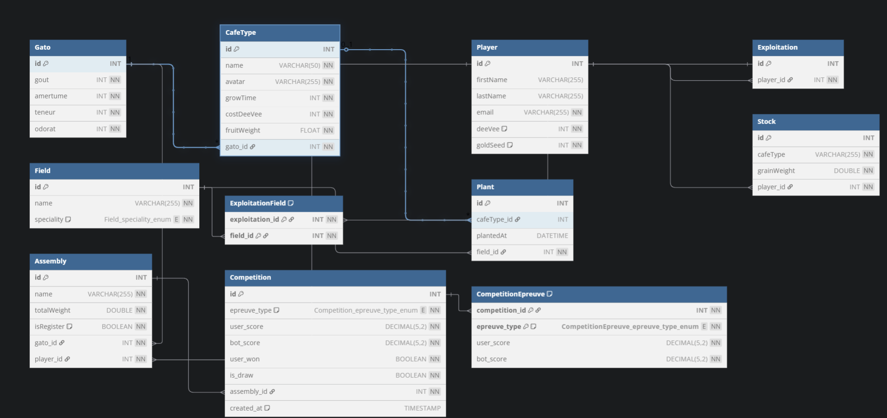

# ☕ KafeCraft

## **KafeCraft** https://github.com/dryxos118/kafecraft_exam



---

## Sujet de L'exam

Project Flutter avec Utilisation de Firebase

[Voir le sujet de l'exam](./assets/Sujet%20Exam%202025%20-%20Version%20B%20-%20fin%20année%20Mobile.pdf)

---

## Prérequis

- [Flutter SDK](https://flutter.dev/docs/get-started/install) (version stable recommandée)
- Un émulateur Android/iOS ou un appareil connecté

---

## Lancer le projet localement

### 1. Cloner le dépôt

```bash
git clone https://github.com/ton-pseudo/kafecraft.git
cd kafecraft
```

### 2. Installer les dépendances

```bash
flutter pub get
```

### 3. Lancer un simulateur

Android Studio, Xcode ou en ligne de commande :

```bash
flutter emulators --launch <nom-de-ton-emulateur>
```

### 4. Exécuter l'application

```bash
flutter run
```

### 5. Ou generer un apk

```bash
flutter build apk --release
```

---

## Structure du projet

```
lib/
├── model/               # Modèles de données (Player, Field, Assembly...)
├── provider/            # Providers Riverpod (State, Stream)
├── widget/              # Composants UI réutilisables
├── views/               # Pages principales (Stock, Farme, Competition...)
├── service/             # Services (Snackbar)
├── data/                # Données statiques (café types)
```

---

## Fonctionnalités clés

- Authentification utilisateur
- Culture de café (par plante & champ)
- Gestion de stock (par type de cafée)
- Assemblage avec système GATO
- Compétitions en duel contre un bot
- Synchronisation en temps réel via Firestore

---

## Maquete du project realiser sur Figma

---

## Base de données SQL

La base de données est sur firebase mais voici un script sql pour l'ajouter a MySQL

```sql
CREATE DATABASE IF NOT EXISTS kafecraft;
USE kafecraft;

CREATE TABLE IF NOT EXISTS Gato (
    id INT AUTO_INCREMENT PRIMARY KEY,
    gout INT NOT NULL CHECK (gout BETWEEN 0 AND 100),
    amertume INT NOT NULL CHECK (amertume BETWEEN 0 AND 100),
    teneur INT NOT NULL CHECK (teneur BETWEEN 0 AND 100),
    odorat INT NOT NULL CHECK (odorat BETWEEN 0 AND 100)
);

CREATE TABLE IF NOT EXISTS CafeType (
    id INT AUTO_INCREMENT PRIMARY KEY,
    name VARCHAR(50) NOT NULL,
    avatar VARCHAR(255) NOT NULL,
    growTime INT NOT NULL,
    costDeeVee INT NOT NULL,
    fruitWeight FLOAT NOT NULL,
    gato_id INT NOT NULL,
    FOREIGN KEY (gato_id) REFERENCES Gato(id) ON DELETE CASCADE
);

CREATE TABLE IF NOT EXISTS Player (
    id INT AUTO_INCREMENT PRIMARY KEY,
    firstName VARCHAR(255),
    lastName VARCHAR(255),
    email VARCHAR(255) UNIQUE NOT NULL,
    deeVee INT NOT NULL DEFAULT 10,
    goldSeed INT NOT NULL DEFAULT 0
);

CREATE TABLE IF NOT EXISTS Exploitation (
    id INT AUTO_INCREMENT PRIMARY KEY,
    player_id INT NOT NULL,
    FOREIGN KEY (player_id) REFERENCES Player(id) ON DELETE CASCADE
);

CREATE TABLE IF NOT EXISTS Field (
    id INT AUTO_INCREMENT PRIMARY KEY,
    name VARCHAR(255) NOT NULL,
    speciality ENUM('rendementX2', 'tempsDiv2', 'neutre') NOT NULL DEFAULT 'neutre'
);

CREATE TABLE IF NOT EXISTS ExploitationField (
    exploitation_id INT NOT NULL,
    field_id INT NOT NULL,
    PRIMARY KEY (exploitation_id, field_id),
    FOREIGN KEY (exploitation_id) REFERENCES Exploitation(id) ON DELETE CASCADE,
    FOREIGN KEY (field_id) REFERENCES Field(id) ON DELETE CASCADE
);

CREATE TABLE IF NOT EXISTS Plant (
    id INT AUTO_INCREMENT PRIMARY KEY,
    cafeType_id INT,
    plantedAt DATETIME,
    field_id INT NOT NULL,
    FOREIGN KEY (cafeType_id) REFERENCES CafeType(id) ON DELETE SET NULL,
    FOREIGN KEY (field_id) REFERENCES Field(id) ON DELETE CASCADE
);

CREATE TABLE IF NOT EXISTS Stock (
    id INT AUTO_INCREMENT PRIMARY KEY,
    cafeType VARCHAR(255) NOT NULL,
    grainWeight DOUBLE PRECISION NOT NULL,
    player_id INT NOT NULL,
    FOREIGN KEY (player_id) REFERENCES Player(id) ON DELETE CASCADE
);

CREATE TABLE IF NOT EXISTS Assembly (
    id INT AUTO_INCREMENT PRIMARY KEY,
    name VARCHAR(255) NOT NULL,
    totalWeight DOUBLE PRECISION NOT NULL,
    isRegister BOOLEAN NOT NULL DEFAULT FALSE,
    gato_id INT NOT NULL,
    player_id INT NOT NULL,
    FOREIGN KEY (gato_id) REFERENCES Gato(id),
    FOREIGN KEY (player_id) REFERENCES Player(id) ON DELETE CASCADE
);

CREATE TABLE IF NOT EXISTS Competition (
    id INT AUTO_INCREMENT PRIMARY KEY,
    epreuve_type ENUM('tasse', 'kafetiere', 'degustation') NOT NULL,
    user_score DECIMAL(5,2) NOT NULL,
    bot_score DECIMAL(5,2) NOT NULL,
    user_won BOOLEAN NOT NULL,
    is_draw BOOLEAN NOT NULL,
    assembly_id INT NOT NULL,
    created_at TIMESTAMP DEFAULT CURRENT_TIMESTAMP,
    FOREIGN KEY (assembly_id) REFERENCES Assembly(id) ON DELETE CASCADE
);

CREATE TABLE IF NOT EXISTS CompetitionEpreuve (
    competition_id INT NOT NULL,
    epreuve_type ENUM('tasse', 'kafetiere', 'degustation') NOT NULL,
    user_score DECIMAL(5,2) NOT NULL,
    bot_score DECIMAL(5,2) NOT NULL,
    PRIMARY KEY (competition_id, epreuve_type),
    FOREIGN KEY (competition_id) REFERENCES Competition(id) ON DELETE CASCADE
);

INSERT INTO Gato (gout, amertume, teneur, odorat) VALUES
(15, 54, 35, 19),   -- Pour Rubisca
(87, 4, 35, 59),    -- Pour Arbrista
(35, 41, 75, 67),   -- Pour Roupetta
(3, 91, 74, 6),     -- Pour Tourista
(39, 9, 7, 87);     -- Pour Goldoria

INSERT INTO CafeType (name, avatar, growTime, costDeeVee, fruitWeight, gato_id) VALUES
('Rubisca', '🌱', 1, 2, 0.632, 1),
('Arbrista', '🌳', 4, 6, 0.274, 2),
('Roupetta', '🍒', 2, 3, 0.461, 3),
('Tourista', '🌿', 1, 1, 0.961, 4),
('Goldoria', '✨', 3, 2, 0.473, 5);
```

---

## MCD de la base de données SQL



---

Développé par Alexis
